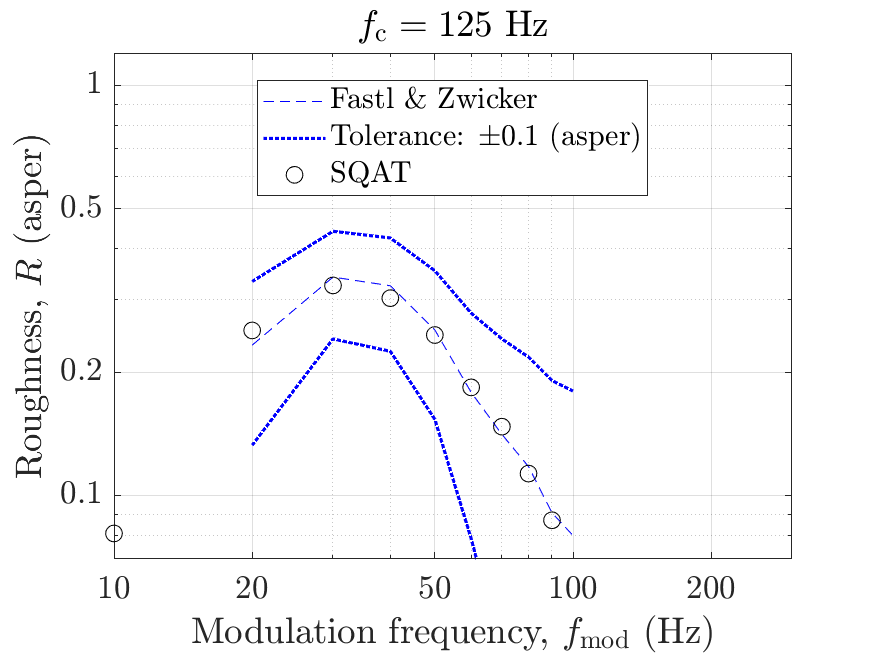
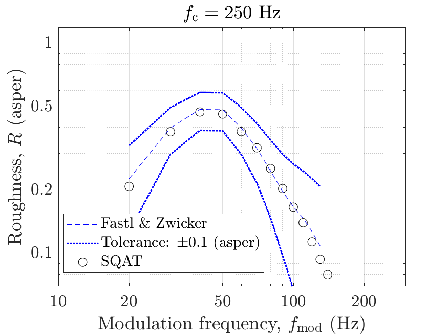
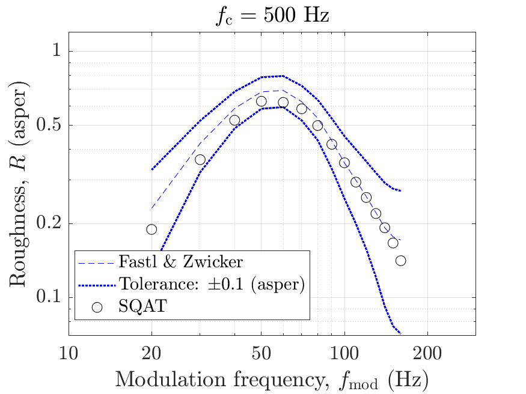
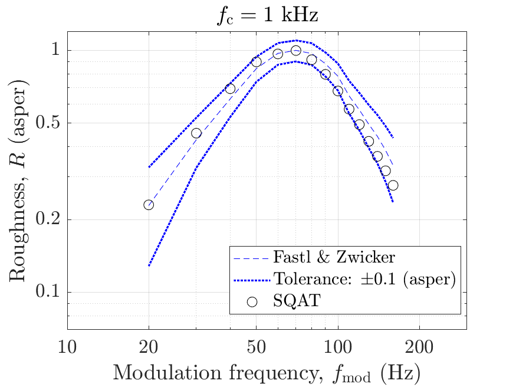
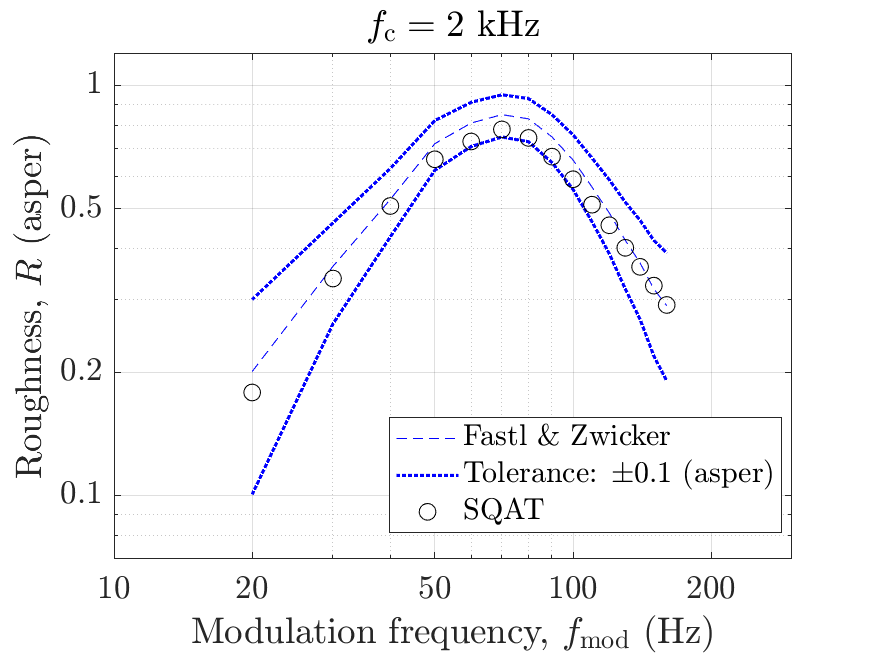
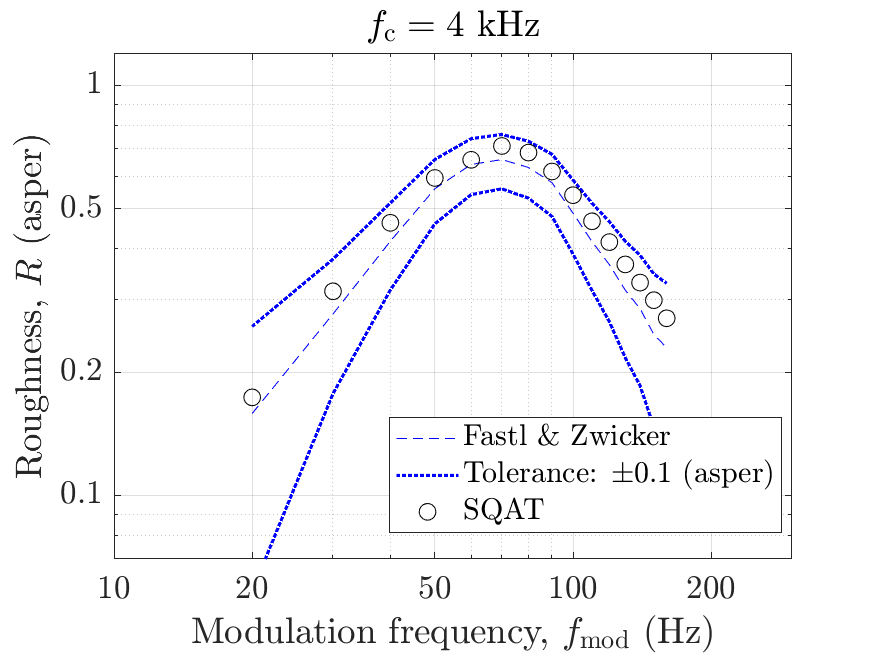
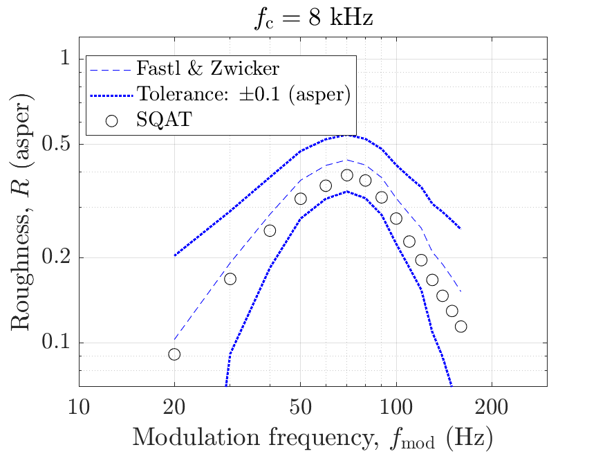

# About this code 
The `run_validation_roughness_fmod.m` code is used to verify the implementation of the roughness model according to ECMA-418-2:2024 [1] (see `Roughness_ECMA418_2` code [here](../../../psychoacoustic_metrics/Roughness_ECMA418_2/Roughness_ECMA418_2.m)). The verification is performed considering the following test signals:

- Amplitude-modulated (AM) tones with modulation depth $m_{\mathrm{d}}=1$, sound pressure level $L_{\mathrm{p}}=60~\mathrm{dB}~\mathrm{SPL}$ and different carrier frequencies $f_{\mathrm{c}}=[125, 250, 500, 1000, 2000, 4000, 8000] ~\mathrm{Hz}$ as a function of the modulation frequency $f_{\mathrm{mod}}$.  

# How to use this code
This code uses the same signals and referefnce values used for the validation of the roughness model implementation of the Daniel & Weber model ([link](../../../validation/Roughness_Daniel1997/1_AM_modulation_freq)), which was performed in SQAT v1.0. In order to run the code and reproduce the figures available in the `figs` folder, the user needs to download the dataset of sound files from zenodo <a href="https://doi.org/10.5281/zenodo.7933206" target="_blank">here</a>. The obtained folder called `validation_SQAT_v1_0` has to be included in the `sound_files` folder of the toolbox. 

# Results
The figures below compare the results obtained using the `Roughness_ECMA418_2` implementation in SQAT with reference data from Fastl & Zwicker [2]. The reference values were obtained from [3, Fig. 3.3 (open symbols)]. Results computed using SQAT correspond the 90th percentile of the time-dependent roughness, as defined in ECMA-418-2:2024 (Section 7.1.10). 

|        |        |
| -------------- | -------------- |

|    |   |
| -------------- | -------------- |

|    |   |
| -------------- | -------------- |

  

# References
[1] European Computer Manufacturers Association. (2024). Psychoacoustic metrics for ITT equipment — Part 2 (methods for describing human perception based on the Sottek Hearing Model) (ECMA international standard No. 418-2, 3rd Edition/December 2024). [https://ecma-international.org/wp-content/uploads/ECMA-418-2_3rd_edition_december_2024.pdf](https://ecma-international.org/wp-content/uploads/ECMA-418-2_3rd_edition_december_2024.pdf) (Last viewed 14 Jan 2025)

[2] Fastl, H., & Zwicker, E. (2007). Psychoacoustics: facts and models, Third edition. [Springer-Verlag](https://doi.org/10.1007/978-3-540-68888-4).

[3] Daniel, P., & Weber, R. (1997). Psychoacoustical Roughness: Implementation of an Optimized Model. [Acta Acustica united with Acustica](https://www.ingentaconnect.com/content/dav/aaua/1997/00000083/00000001/art00020), 83(1), 113-123.

# Log
Gil Felix Greco, First commit (16.01.2025)

